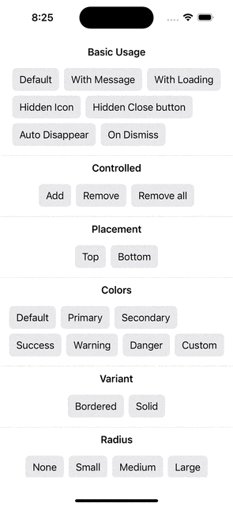

# Toaster for SwiftUI

A simple library for showing toasts and banners in SwiftUI.


## Features

### Basic
- Show Toasts and Banners (Top or bottom placement)
- Built-in view with Custom Title, message, icon
    - with or without close button, icon
- Able to customize the entire toast view
- Built-in Color variations or custom color with Color Scheme (Dark/Light) supports.
- Variant: Plain or bordered
- Configurable toast view Corner radius
- Support loading state with async/await, custom title, and message
- Auto-dismissible
- Custom callback on toast dismissed


### Additional
- Expand and fold toasts when multiple added
- Enable/disable animation


## Installation
1. Under Project > Package Dependencies, choose `+` to add package.
2. Search for the following URL

```
https://github.com/0Itsuki0/Toaster-SwiftUI
```


3. For Dependency Rule, choose Branch > main
4. Choose Add Package.


## Usage

A demo app is available [here](https://github.com/0Itsuki0/ToasterDemo-SwiftUI).


### Set up

Provide Toaster in the root view

```
import SwiftUI
import Toaster

@main
struct ToasterDemoApp: App {
    var body: some Scene {
        WindowGroup {
            ContentView()
                .provideToaster(animationDisabled: false)
        }
    }
}
```

### Present and Remove

1. Present a toast

```
@Environment(\.addToast) private var addToast

Button(action: {
    let toastId = addToast(title: title)
}, label: {
    Text("Add Toast")
})

```


2. Remove a toast
```
@Environment(\.removeToast) private var removeToast

Button(action: {
    removeToast(toastId)
}, label: {
    Text("Remove Toast")
})

```


## Examples

### Basic Usage


```
@State private var showToastDismissMessage: Bool = false

VStack(alignment: .leading) {
    HStack() {
        Button(action: {
            addToast(title: title)
        }, label: {
            Text("Default")
        })

        Button(action: {
            addToast(title: title, message: message)
        }, label: {
            Text("With Message")
        })

        Button(action: {
            let loadingConfig = LoadingConfig(promise: { await sleep(0.5) }, title: "Loading")
            addToast(title: title, loadingConfig: loadingConfig)
        }, label: {
            Text("With Loading")
        })

    }

    HStack() {
        Button(action: {
            addToast(title: title, showIcon: false)

        }, label: {
            Text("Hidden Icon")
        })

        Button(action: {
            addToast(title: title, showCloseButton: false)

        }, label: {
            Text("Hidden Close button")
        })

    }

    HStack() {
        Button(action: {
            addToast(title: title, timeout: 1.0)
        }, label: {
            Text("Auto Disappear")
        })

        Button(action: {
            addToast(title: title, onDismiss: {
                withAnimation {
                    showToastDismissMessage = true
                }
            })
        }, label: {
            Text("On Dismiss")
        })

    }
}
.overlay(alignment: .top, content: {
    if showToastDismissMessage {
        Text("Toast dismissed")
            .padding()
            .background(RoundedRectangle(cornerRadius: 4).fill(.gray))
            .padding(.bottom, 8)
            .frame(maxWidth: .infinity)
            .background(.white.opacity(0.7))
            .onAppear {
                DispatchQueue.main.asyncAfter(deadline: .now() + 1, execute: {
                    showToastDismissMessage = false
                })
            }
    }
})

```


### Controlled



```
@State private var toastId: ToastConfig.ID?

HStack() {
    Button(action: {
        self.toastId = addToast(title: title)
    }, label: {
        Text("Add")
    })
    Button(action: {
        if let toastId = self.toastId {
            removeToast(toastId)
        }
    }, label: {
        Text("Remove")
    })
    
    Button(action: {
        removeToast()
    }, label: {
        Text("Remove all")
    })
}
```


### Placement


```
HStack() {
    Button(action: {
        addToast(title: title, style: .init(placement: .top))
    }, label: {
        Text("Top")
    })
    Button(action: {
        addToast(title: title, style: .init(placement: .bottom))
    }, label: {
        Text("Bottom")
    })
}
```


### Colors


```
VStack(alignment: .leading) {
    HStack() {
        Button(action: {
            addToast(title: title, style: .init(color: .default))
        }, label: {
            Text("Default")
        })
        Button(action: {
            addToast(title: title, style: .init(color: .primary))
        }, label: {
            Text("Primary")
        })
        Button(action: {
            addToast(title: title, style: .init(color: .secondary))

        }, label: {
            Text("Secondary")
        })
    }
    HStack() {
        Button(action: {
            addToast(title: title, style: .init(color: .success))

        }, label: {
            Text("Success")
        })

        Button(action: {
            addToast(title: title, style: .init(color: .warning))

        }, label: {
            Text("Warning")
        })
        Button(action: {
            addToast(title: title, style: .init(color: .danger))

        }, label: {
            Text("Danger")
        })
        Button(action: {
            addToast(title: title, style: .init(color: .custom(Color.mint)))

        }, label: {
            Text("Custom")
        })
    }
}

```

### Variant


```
HStack() {
    Button(action: {
        addToast(title: title, style: .init(variant: .bordered))

    }, label: {
        Text("Bordered")
    })
    Button(action: {
        addToast(title: title, style: .init(variant: .solid))

    }, label: {
        Text("Solid")
    })
}
```


### Radius


```
VStack(alignment: .leading) {
    HStack() {
        Button(action: {
            addToast(title: title, style: .init(radius: .none))

        }, label: {
            Text("None")
        })
        Button(action: {
            addToast(title: title, style: .init(radius: .small))

        }, label: {
            Text("Small")
        })
        Button(action: {
            addToast(title: title, style: .init(radius: .medium))

        }, label: {
            Text("Medium")
        })

        Button(action: {
            addToast(title: title, style: .init(radius: .large))

        }, label: {
            Text("Large")
        })

    }

    HStack() {
        Button(action: {
            addToast(title: title, style: .init(radius: .full))

        }, label: {
            Text("Full")
        })

        Button(action: {
            addToast(title: title, style: .init(radius: .custom(20)))
        }, label: {
            Text("Custom")
        })
    }
}
```


### Customize


```
HStack() {
    Button(action: {
        addToast(title: title, customIcon: Image(systemName: "heart.fill"))
    }, label: {
        Text("Custom Icon")
    })

    Button(action: {
        addToast(content: {
            VStack(spacing: 24){
                HStack {
                    Image(systemName: "heart.fill")
                    Text(title)
                    Image(systemName: "heart.fill")
                }

                HStack {
                    Image(systemName: "heart.fill")
                    Text(message)
                    Image(systemName: "heart.fill")
                }
                .foregroundStyle(.red)
            }
        })
    }, label: {
        Text("Custom View")
    })
}
```
